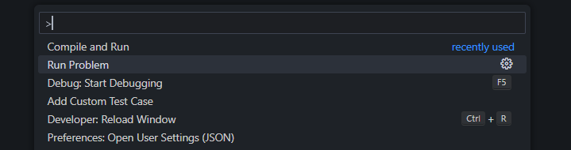
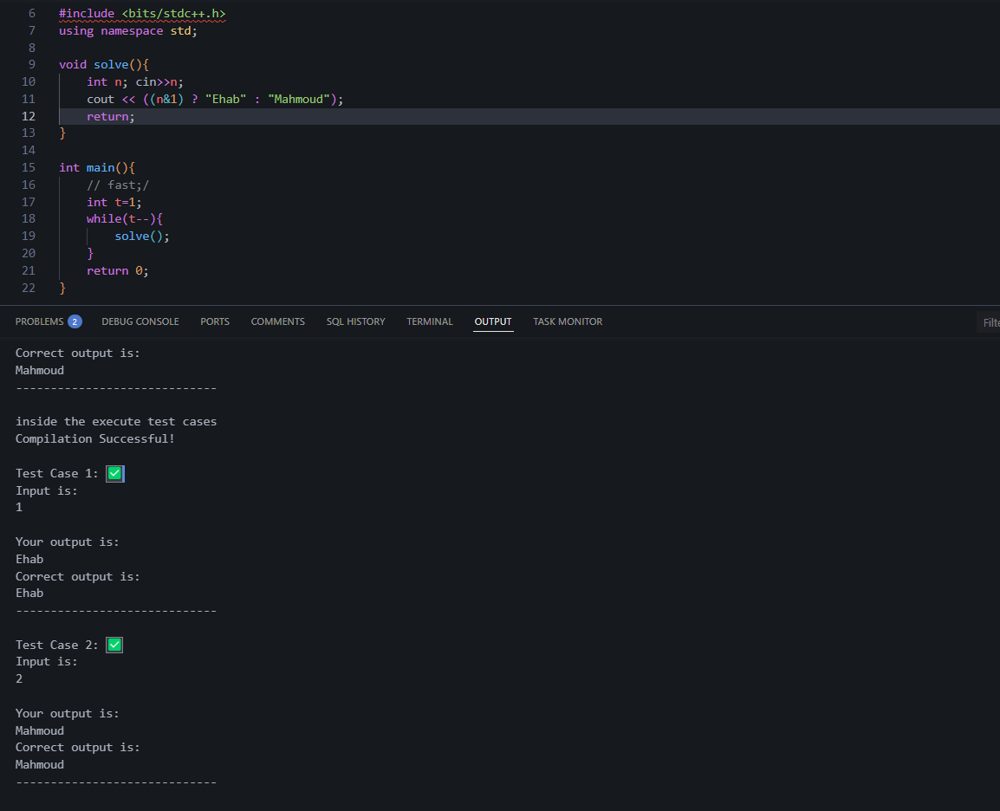

# 🚀 Competitive Programming Helper for VS Code

A **VS Code extension** that helps you fetch coding problems, generate boilerplate code, and run test cases efficiently.

## 📌 Features

✅ **Fetch Problems:** Automatically retrieves problem data from a local server.  
✅ **Generate Boilerplate Code:** Creates a `solution.cpp` file with a ready-to-use template.  
✅ **Run Test Cases:** Compiles and runs code against test cases.  
✅ **Supports Extra Test Cases:** Reads additional test cases from `testcases.txt`.  
✅ **Custom Test Cases:** Provides a UI for adding custom test cases.  

---

## 📂 Project Structure

```
📁 your-extension/
│── 📄 extension.js           # Main VS Code extension logic
│── 📄 problemHandler.js      # Handles fetching and processing problems
│── 📄 testRunner.js          # Manages compilation and test execution
│── 📄 uiManager.js           # Handles UI elements like test case input
│── 📄 utils.js               # Utility functions (file handling, formatting)
│── 📄 package.json           # VS Code extension metadata
│── 📄 icon.png               # Extension icon
│── 📄 README.md              # This file
```

---

## 🛠️ Installation

1. **Clone this repository:**
   ```sh
   git clone https://github.com/Codeforces-Vs-Code-collaborator/CP-Code-Runner.git
   cd CP-Code-Runner
   ```

2. **Install dependencies (if any):**
   ```sh
   npm install
   ```

3. **Run in VS Code (Development Mode):**
   - Open the project in **VS Code**.
   - Press `F5` to launch a new VS Code window with the extension loaded.

---

## 🚀 Usage Guide

1. **Fetch Problem:**
   - Use the command **"Fetch Problem"** from the command palette (`Ctrl+Shift+P`).
   - Select a folder where the problem files will be created.

2. **Run Solution:**
   - Write your solution in `solution.cpp`.
   - Use the **"Run Test Cases"** command.

3. **Add Custom Test Cases:**
   - Use the **"Add Custom Test Case"** command.
   - Enter input and expected output in the UI form.

---

## 🖼️ Screenshot

- Use the Command **"Run Problem"** from the command palette(`Ctrl+Shift+P`)



- Select the location where you want to store the Problem folder.


- The **"solution.cpp"** file will open on it's own, user does not have to navigate to the problem folder.


- Use the command **"Compile and Run"** from the command palette(`Ctrl+Shift+P`) to tun the test Cases on the written solution


- The compilation of code is done and output for the input test Cases for the problem are run and the corresponding output gets printed in the Output



- Use the Command **"Add Custom Test Case"** from the command palette(`Ctrl+Shift+P`) to add some custom Test Case to run on the problem.


- A HTML page gets opened with input textAreas for both testCase input and testCase Output. Click on **"Submit"** button to add the input testCase to the 
testcases.txt file


- A file named **"testcases.txt"** get's created in the Problem Folder with the input test Case in it as soon as the **"Submit"** button is clicked

---

## 📌 Contribution

Want to improve this extension? Feel free to submit issues or PRs!

---

## 📜 License

MIT License

---

Let me know if you need modifications! 🚀